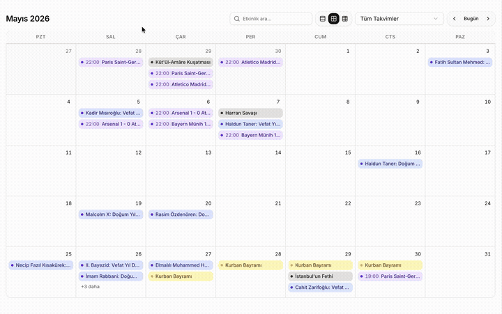

# Calendar Subscription

**English** | [Türkçe](./README.tr.md)

[takvim.omergulcicek.com](https://takvim.omergulcicek.com)

Free, open-source calendar subscription platform offering curated multi-category event feeds. Subscribe to the days, matches, and anniversaries you care about in Apple, Google, or Outlook Calendar. Events refresh automatically as sources update — no file downloads needed.

The site includes a monthly calendar preview. Select categories, copy the subscription link, and add it to your calendar app. Subscribe to each category separately if you want distinct colors; combining them creates a single calendar with one color.

## Calendar categories

### Religion & Faith

- **Religious Days** — Kandils, festivals, and holy nights
- **Islamic History** — Key dates and anniversaries in Islamic history
- **Notable Figures** — Birth and death anniversaries of scholars, thinkers, statesmen, and community leaders

### Culture & Literature

- **National & Cultural Days** — Official days, cultural festivals, and awareness weeks
- **Turkish Literature** — Author and work anniversaries from Turkish literature

### History

- **Historical Events** — Wars, conquests, sieges; tragedies, genocides, and remembrance days

### Football

- **Beşiktaş**, **Fenerbahçe**, **Galatasaray**, **Trabzonspor** — League, cup, and European matches
- **World Cup** — FIFA World Cup matches
- **Champions League** — UEFA Champions League matches
- **Premier League** — English Premier League matches
- **La Liga** — Spanish La Liga matches

## How to use

1. Select the categories you want on the site.
2. Copy the subscription link.
3. Add it as a subscription in Apple Calendar, Google Calendar, or Outlook.

Step-by-step instructions are in the “How do I add it?” section on the site.
